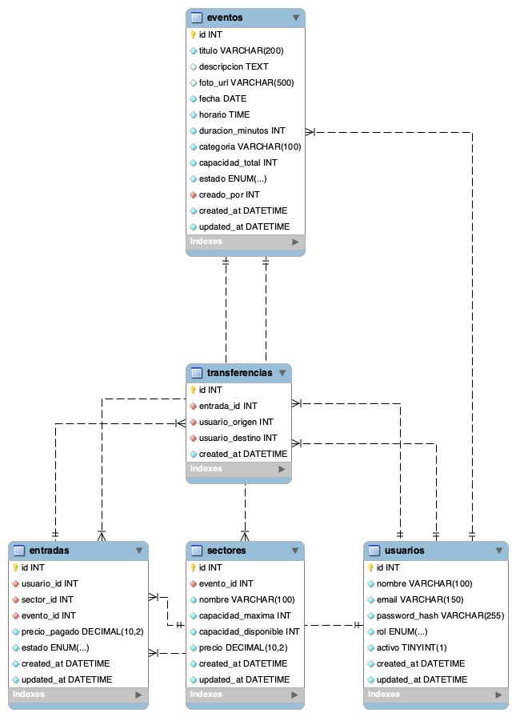

# SmartTicket 🎟️

Sistema de gestión de eventos y entradas (tipo Ticketek), desarrollado como Práctico Integrador de la materia **Desarrollo de Software 2026**.

Permite a los usuarios explorar un catálogo de eventos, ver el detalle de cada uno, comprar entradas, gestionar su historial de tickets (cancelar/transferir) y, para administradores, gestionar el catálogo de eventos y consultar reportes de ventas/ocupación.

## Tabla de Contenidos

- [Capturas de pantalla](#capturas-de-pantalla)
- [Tecnologías Utilizadas](#tecnologías-utilizadas)
- [Requisitos Previos](#requisitos-previos)
- [Instalación y Uso](#instalación-y-uso)
- [Diagrama de Base de Datos](#diagrama-de-base-de-datos)
- [Decisiones de Diseño](#decisiones-de-diseño)

## Capturas de pantalla

> _Pendiente: agregar capturas del catálogo, detalle de evento, compra y panel de administración._

## Tecnologías Utilizadas

### Backend
- **Go 1.22**
- **Gin** (framework HTTP / router)
- **GORM** (ORM) + **MySQL Driver**
- **JWT** (`golang-jwt/jwt`) para autenticación y autorización
- **bcrypt** (`golang.org/x/crypto`) para el hashing de contraseñas
- **godotenv** para variables de entorno

### Frontend
- **React 18**
- **Vite**
- **React Router DOM**
- **Axios**

### Base de Datos
- **MySQL**

## Requisitos Previos

- [Go](https://go.dev/dl/) >= 1.22
- [Node.js](https://nodejs.org/) >= 18 y npm
- [MySQL](https://dev.mysql.com/downloads/) >= 8 corriendo localmente

## Instalación y Uso

### 1. Clonar el repositorio
```bash
git clone https://github.com/Fedeaalmada/smart-ticket.git
cd smart-ticket
```

### 2. Configurar la Base de Datos
Creá la base de datos en MySQL:
```sql
CREATE DATABASE ticketek_db;
```

Importá el esquema y los datos de ejemplo (en orden):
```bash
mysql -u root ticketek_db < docs/ticketek_db_usuarios.sql
mysql -u root ticketek_db < docs/ticketek_db_eventos.sql
mysql -u root ticketek_db < docs/ticketek_db_sectores.sql
mysql -u root ticketek_db < docs/ticketek_db_entradas.sql
mysql -u root ticketek_db < docs/ticketek_db_transferencias.sql
mysql -u root ticketek_db < docs/ticketek_db_routines.sql
```

### 3. Configurar variables de entorno (Backend)
Copiá el archivo de ejemplo y completá con tus datos:
```bash
cp .env.example .env
```

Variables disponibles:
```env
DB_HOST=localhost
DB_PORT=3306
DB_USER=root
DB_PASSWORD=tu_password
DB_NAME=ticketek_db

JWT_SECRET=un_secreto_largo_y_seguro
JWT_EXPIRATION_HOURS=24

SERVER_PORT=8080
```

### 4. Levantar el Backend
```bash
go mod tidy
go run main.go
```
El servidor queda disponible en `http://localhost:8080`.

### 5. Levantar el Frontend
```bash
cd smartticket-frontend/smartticket-frontend
npm install
npm run dev
```
La aplicación queda disponible en `http://localhost:3000` (con proxy configurado hacia el backend en `/api`).

### 6. Correr los tests (Backend)
```bash
go test ./... -cover
```

## Diagrama de Base de Datos

El modelo de datos contempla las entidades **Usuarios**, **Eventos**, **Sectores**, **Entradas** y **Transferencias**, mapeadas mediante GORM con sus respectivas claves foráneas.



## Decisiones de Diseño

1. **Cancelación de eventos mediante soft delete**: en lugar de eliminar físicamente un evento de la base de datos, la cancelación (`Funcionalidad C - Admin`) actualiza el campo `estado` del evento a `cancelado`. Esto preserva la integridad referencial con las entradas ya vendidas y permite mantener el historial de ventas/reportes aunque el evento ya no esté disponible para nuevas compras.

2. **Sectores como entidad intermedia entre Eventos y Entradas**: en lugar de manejar un único `cupo` global por evento, se introdujo la entidad `Sector` (ej. Campo, Platea, VIP), cada uno con su propia capacidad y precio. Esto permite calcular la `capacidad_total` del evento como la suma de sus sectores, controlar la disponibilidad de forma granular al comprar/cancelar entradas, y soportar distintos precios según la ubicación.

3. **Transferencia de titularidad sin perder el estado activo**: al transferir una entrada (`Funcionalidad F - Cliente`), se actualiza el `usuario_id` de la entrada manteniendo su estado en `activa`, de forma que el nuevo titular pueda operar normalmente sobre su ticket (cancelarlo o re-transferirlo). El historial de quién tuvo cada entrada se conserva por separado en la tabla `transferencias`.
